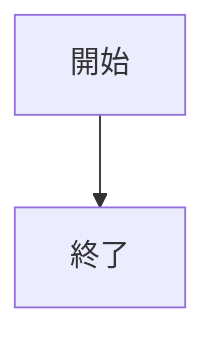
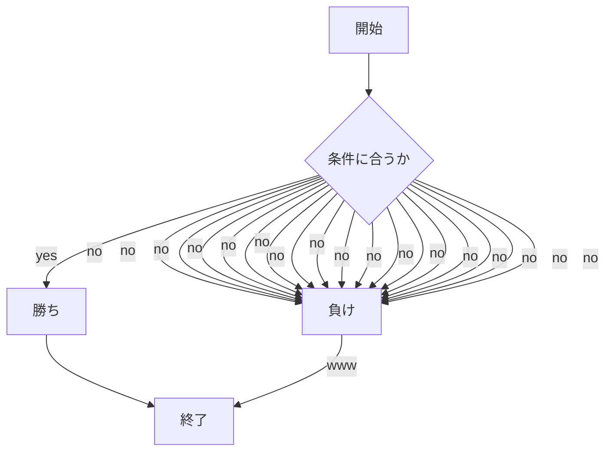

# webpro_06
2024/10/29
## 概要
Webプログラミングでやったやつ

ファイル名 | 説明
-|-
app5.js|プログラム本体
janken.html|じゃんけんを表示

## 使用方法
1. ```node app5.js```で起動する
1. Webブラウザでlocalhost:8080/public/janken.htmlにアクセスする
1. 自分の手を入力する

## 今後の更新予定
ある

## example

```javascript
console.log("Hello");
```



